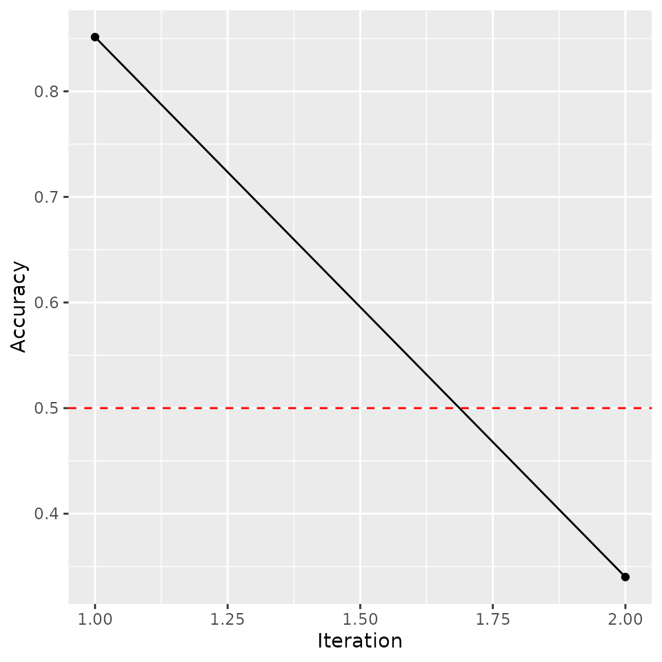
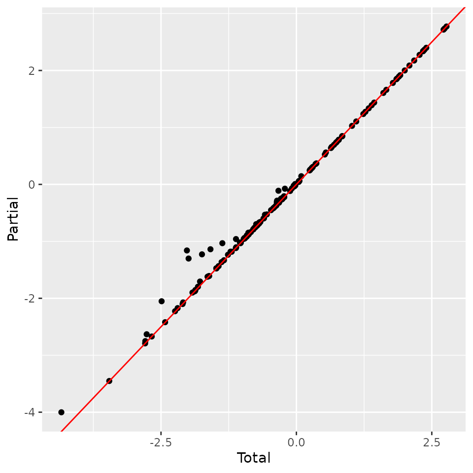
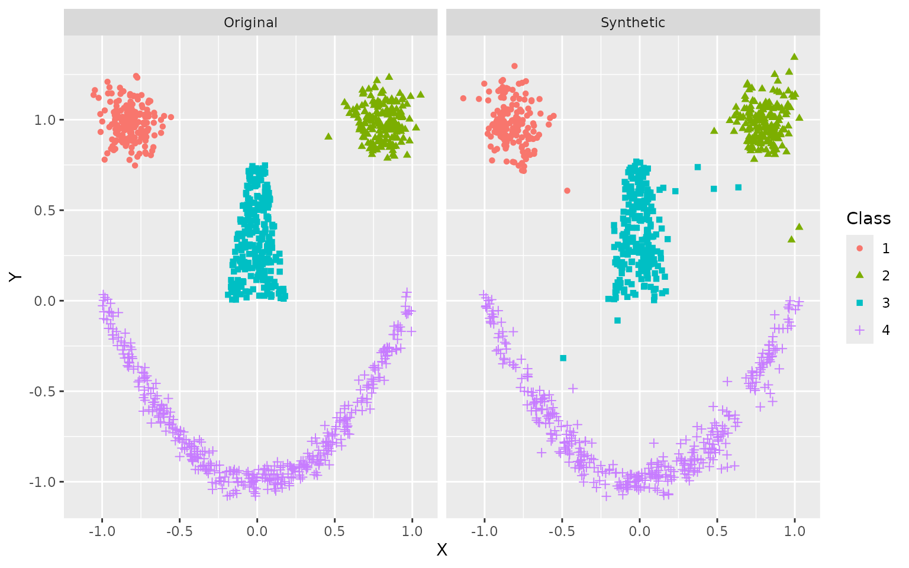
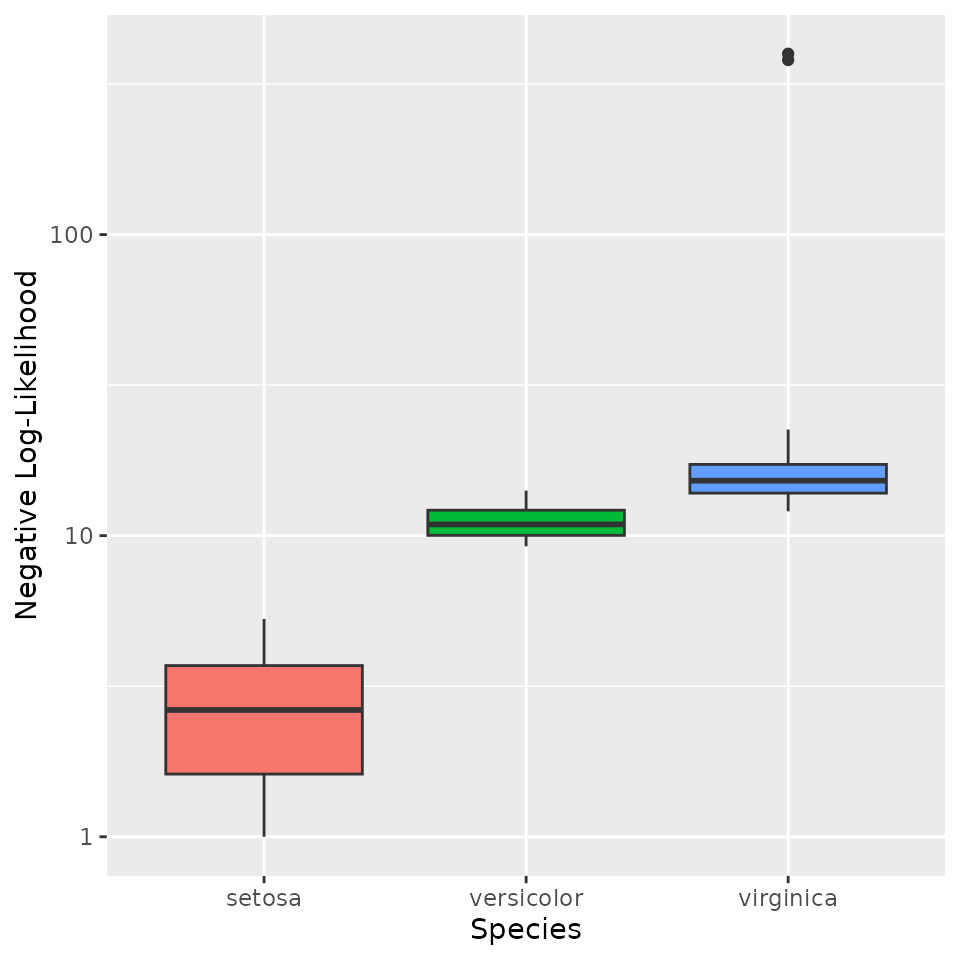
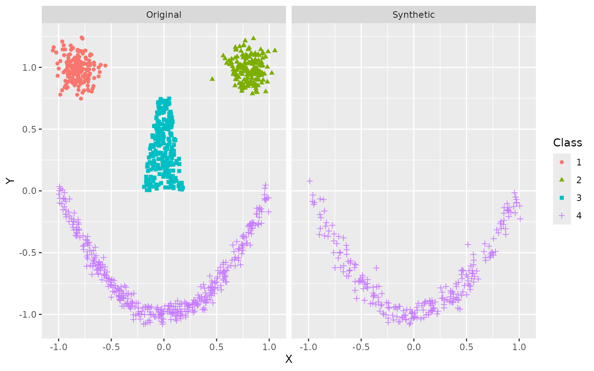
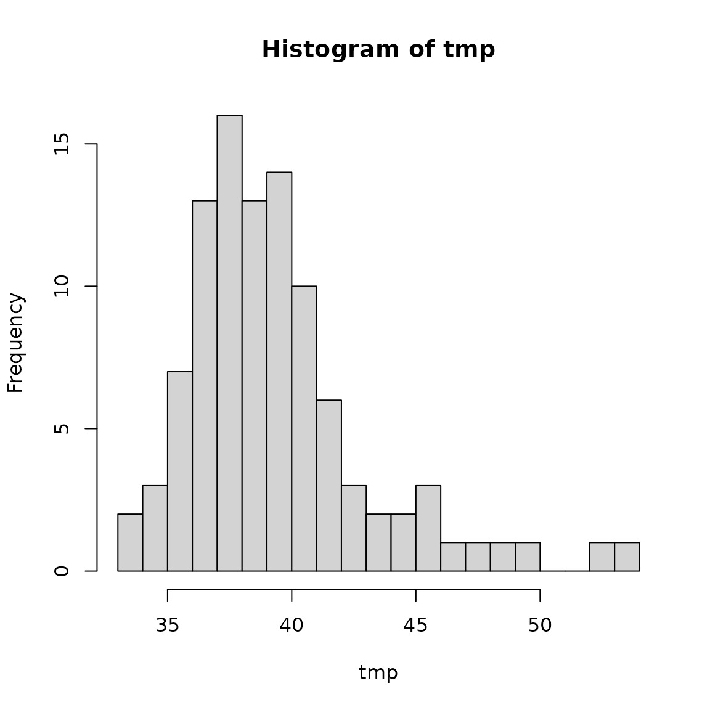

# Adversarial Random Forests

This vignette covers the entire adversarial random forest (ARF)
pipeline, from model training to parameter learning, density estimation,
and data synthesis.

## Adversarial Training

The ARF algorithm is an iterative procedure. In the first instance, we
generate synthetic data by independently sampling from the marginals of
each feature and training a random forest (RF) to distinguish original
from synthetic samples. If accuracy is greater than $`0.5 + \delta`$
(where `delta` is a user-controlled tolerance parameter, generally set
to 0), we create a new dataset by sampling from the marginals within
each leaf and training another RF classifier. The procedure repeats
until original and synthetic samples cannot be reliably distinguished.
With the default `verbose = TRUE`, the algorithm will print accuracy at
each iteration.

``` r

# Load libraries
library(arf)
library(data.table)
#> 
#> Attaching package: 'data.table'
#> The following object is masked from 'package:base':
#> 
#>     %notin%
library(ggplot2)

# Set seed
set.seed(123, "L'Ecuyer-CMRG")

# Train ARF
arf_iris <- adversarial_rf(iris)
#> Iteration: 0, Accuracy: 76.09%
#> Iteration: 1, Accuracy: 40.33%
#> Warning: executing %dopar% sequentially: no parallel backend registered
```

The printouts can be turned off by setting `verbose = FALSE`. Accuracy
is still stored within the `arf` object, so you can evaluate convergence
after the fact. The warning appears just once per session. It can be
suppressed by setting `parallel = FALSE` or registering a parallel
backend (more on this below).

``` r

# Train ARF with no printouts
arf_iris <- adversarial_rf(iris, verbose = FALSE)

# Plot accuracy against iterations (model converges when accuracy <= 0.5)
tmp <- data.frame('Accuracy' = arf_iris$acc, 
                  'Iteration' = seq_len(length(arf_iris$acc)))
ggplot(tmp, aes(Iteration, Accuracy)) + 
  geom_point() + 
  geom_path() +
  geom_hline(yintercept = 0.5, linetype = 'dashed', color = 'red') 
```



We find a quick drop in accuracy following the resampling procedure, as
desired. If the ARF has converged, then resulting splits should form
fully factorized leaves, i.e. subregions of the feature space where
variables are locally independent.

ARF convergence is asymptotically guaranteed as $`n \rightarrow \infty`$
(see [Watson et al.,
2023](https://proceedings.mlr.press/v206/watson23a.html), Thm. 1).
However, this has no implications for finite sample performance. In
practice, we often find that adversarial training completes in just one
or two rounds, but this may not hold for some datasets. To avoid
infinite loops, users can increase the slack parameter `delta` or set
the `max_iters` argument (default = 10). In addition to these failsafes,
`adversarial_rf` uses early stopping by default `(early_stop = TRUE)`,
which terminates training if factorization does not improve from one
round to the next. This is recommended, since discriminator accuracy
rarely falls much lower once it has increased.

For density estimation tasks, we recommend increasing the default number
of trees. We generally use 100 in our experiments, though this may be
suboptimal for some datasets. Likelihood estimates are not very
sensitive to this parameter above a certain threshold, but larger models
incur extra costs in time and memory. We can speed up computations by
registering a parallel backend, in which case ARF training is
distributed across cores using the `ranger` package. Much like with
`ranger`, the default behavior of `adversarial_rf` is to compute in
parallel if possible. How exactly this is done varies across operating
systems. The following code works on Unix machines.

``` r

# Register cores - Unix
library(doParallel)
registerDoParallel(cores = 2)
```

Windows requires a different setup.

``` r

# Register cores - Windows
library(doParallel)
cl <- makeCluster(2)
registerDoParallel(cl)
```

In either case, we can now execute in parallel.

``` r

# Rerun ARF, now in parallel and with more trees
arf_iris <- adversarial_rf(iris, num_trees = 100)
#> Iteration: 0, Accuracy: 85.67%
#> Iteration: 1, Accuracy: 40.67%
```

The result is an object of class `ranger`, which we can input to
downstream functions.

## Parameter Learning

The next step is to learn the leaf and distribution parameters using
forests for density estimation (FORDE). This function calculates the
coverage, bounds, and pdf/pmf parameters for every variable in every
leaf. This can be an expensive computation for large datasets, as it
requires $`\mathcal{O}\big(B \cdot d \cdot n \cdot \log(n)\big)`$
operations, where $`B`$ is the number of trees, $`d`$ is the data
dimensionality, and $`n`$ is the sample size. Once again, the process is
parallelized by default.

``` r

# Compute leaf and distribution parameters
params_iris <- forde(arf_iris, iris)
```

Default behavior is to use a truncated normal distribution for
continuous data (with boundaries given by the tree’s split parameters)
and a multinomial distribution for categorical data. We find that this
produces stable results in a wide range of settings. You can also use a
uniform distribution for continuous features by setting
`family = 'unif'`, thereby instantiating a piecewise constant density
estimator.

``` r

# Recompute with uniform density
params_unif <- forde(arf_iris, iris, family = 'unif')
#> Warning in forde(arf_iris, iris, family = "unif"): Density estimation with
#> uniform distribution requires finite bounds. Resetting finite_bounds to
#> "local".
```

This method tends to perform poorly in practice, and we do not recommend
it. The option is implemented primarily for benchmarking purposes.
Alternative families, e.g. truncated Poisson or beta distributions, may
be useful for certain problems. Future releases will expand the range of
options for the `family` argument.

The `alpha` and `epsilon` arguments allow for optional regularization of
multinomial and uniform distributions, respectively. These help prevent
zero likelihood samples when test data fall outside the support of
training data. The former is a pseudocount parameter that applies
[Laplace smoothing](https://en.wikipedia.org/wiki/Additive_smoothing)
within leaves, preventing unobserved values from being assigned zero
probability unless splits explicitly rule them out. In other words, we
impose a flat Dirichlet prior and report posterior probabilities rather
than maximum likelihood estimates. The latter is a slack parameter on
empirical bounds that expands the estimated extrema for continuous
features by a factor of $`1 + \epsilon`$.

Compare the results of our original probability estimates for the
`Species` variable with those obtained by adding a pseudocount of
$`\alpha = 0.1`$.

``` r

# Recompute with additive smoothing
params_alpha <- forde(arf_iris, iris, alpha = 0.1)

# Compare results
head(params_iris$cat)
#> Key: <f_idx, variable>
#>    f_idx variable       val  prob NA_share
#>    <int>   <char>    <char> <num>    <num>
#> 1:     1  Species virginica     1        0
#> 2:     2  Species virginica     1        0
#> 3:     3  Species virginica     1        0
#> 4:     4  Species virginica     1        0
#> 5:     5  Species    setosa     1        0
#> 6:     6  Species    setosa     1        0
head(params_alpha$cat)
#> Key: <f_idx, variable>
#>    f_idx variable        val       prob NA_share
#>    <int>   <char>     <char>      <num>    <num>
#> 1:     1  Species  virginica 0.93939394        0
#> 2:     1  Species     setosa 0.03030303        0
#> 3:     1  Species versicolor 0.03030303        0
#> 4:     2  Species  virginica 0.91304348        0
#> 5:     2  Species     setosa 0.04347826        0
#> 6:     2  Species versicolor 0.04347826        0
```

Under Laplace smoothing, extreme probabilities only occur when the
splits explicitly demand it. Otherwise, all values shrink toward a
uniform prior. Note that these two data tables may not have exactly the
same rows, as we omit zero probability events to conserve memory.
However, we can verify that probabilities sum to unity for each
leaf-variable combination.

``` r

# Sum probabilities
summary(params_iris$cat[, sum(prob), by = .(f_idx, variable)]$V1)
#>    Min. 1st Qu.  Median    Mean 3rd Qu.    Max. 
#>       1       1       1       1       1       1
summary(params_alpha$cat[, sum(prob), by = .(f_idx, variable)]$V1)
#>    Min. 1st Qu.  Median    Mean 3rd Qu.    Max. 
#>       1       1       1       1       1       1
```

The `forde` function outputs a list of length 6, with entries for (1)
continuous features; (2) categorical features; (3) leaf parameters; (4)
variable metadata; (5) factor levels; and (6) data input class.

``` r

params_iris
#> $cnt
#> Key: <f_idx, variable>
#>        f_idx     variable   min   max       mu      sigma NA_share
#>        <int>       <char> <num> <num>    <num>      <num>    <num>
#>     1:     1 Petal.Length  -Inf   Inf 5.933333 0.20816660        0
#>     2:     1  Petal.Width  2.45   Inf 2.500000 0.01041469        0
#>     3:     1 Sepal.Length  -Inf   Inf 6.733333 0.45092498        0
#>     4:     1  Sepal.Width  -Inf   Inf 3.400000 0.17320508        0
#>     5:     2 Petal.Length  -Inf   Inf 5.250000 0.21213203        0
#>    ---                                                            
#> 10484:  2621  Sepal.Width  3.30  3.45 3.400000 0.02209289        0
#> 10485:  2622 Petal.Length  -Inf  4.20 1.400000 0.10000000        0
#> 10486:  2622  Petal.Width  -Inf  0.25 0.200000 0.03124407        0
#> 10487:  2622 Sepal.Length  4.65  5.55 5.266667 0.20816660        0
#> 10488:  2622  Sepal.Width  3.45  3.55 3.500000 0.02082938        0
#> 
#> $cat
#> Key: <f_idx, variable>
#>       f_idx variable        val      prob NA_share
#>       <int>   <char>     <char>     <num>    <num>
#>    1:     1  Species  virginica 1.0000000        0
#>    2:     2  Species  virginica 1.0000000        0
#>    3:     3  Species  virginica 1.0000000        0
#>    4:     4  Species  virginica 1.0000000        0
#>    5:     5  Species     setosa 1.0000000        0
#>   ---                                             
#> 2919:  2618  Species versicolor 0.4615385        0
#> 2920:  2619  Species     setosa 1.0000000        0
#> 2921:  2620  Species     setosa 1.0000000        0
#> 2922:  2621  Species     setosa 1.0000000        0
#> 2923:  2622  Species     setosa 1.0000000        0
#> 
#> $forest
#> Key: <tree, leaf>
#>       f_idx  tree  leaf        cvg
#>       <int> <int> <int>      <num>
#>    1:     1     1     6 0.02000000
#>    2:     2     1    10 0.01333333
#>    3:     3     1    13 0.04000000
#>    4:     4     1    16 0.03333333
#>    5:     5     1    21 0.02000000
#>   ---                             
#> 2618:  2618   100    49 0.08666667
#> 2619:  2619   100    57 0.02000000
#> 2620:  2620   100    58 0.04666667
#> 2621:  2621   100    60 0.04000000
#> 2622:  2622   100    61 0.02000000
#> 
#> $meta
#>        variable   class    family decimals
#>          <char>  <char>    <char>    <int>
#> 1: Sepal.Length numeric truncnorm        1
#> 2:  Sepal.Width numeric truncnorm        1
#> 3: Petal.Length numeric truncnorm        1
#> 4:  Petal.Width numeric truncnorm        1
#> 5:      Species  factor  multinom       NA
#> 
#> $levels
#>    variable        val
#>      <char>     <char>
#> 1:  Species     setosa
#> 2:  Species versicolor
#> 3:  Species  virginica
#> 
#> $input_class
#> [1] "data.frame"
```

These parameters can be used for a variety of downstream tasks, such as
likelihood estimation and data synthesis.

## Likelihood Estimation

To calculate log-likelihoods, we pass `params` on to the `lik` function,
along with the data whose likelihood we wish to evaluate. For *total
evidence* queries (i.e., those spanning all variables and no
conditioning events), it is faster to also include `arf` in the function
call.

``` r

# Compute likelihood under truncated normal and uniform distributions
ll <- lik(params_iris, iris, arf = arf_iris)
ll_unif <- lik(params_unif, iris, arf = arf_iris)

# Compare average negative log-likelihood (lower is better)
-mean(ll)
#> [1] 0.3196718
-mean(ll_unif)
#> [1] -7.291452
```

Note that the piecewise constant estimator does considerably worse in
this experiment.

The `lik` function can also be used to compute the likelihood of some
*partial state*, i.e. a setting in which some but not all variable
values are specified. Let’s take a look at that iris dataset:

``` r

head(iris)
#>   Sepal.Length Sepal.Width Petal.Length Petal.Width Species
#> 1          5.1         3.5          1.4         0.2  setosa
#> 2          4.9         3.0          1.4         0.2  setosa
#> 3          4.7         3.2          1.3         0.2  setosa
#> 4          4.6         3.1          1.5         0.2  setosa
#> 5          5.0         3.6          1.4         0.2  setosa
#> 6          5.4         3.9          1.7         0.4  setosa
```

Say we want to calculate sample likelihoods using only continuous data.
That is, we provide values for the first four variables but exclude the
fifth. In this case, the model will have to marginalize over `Species`:

``` r

# Compute likelihoods after marginalizing over Species
iris_without_species <- iris[, -5]
ll_cnt <- lik(params_iris, iris_without_species)

# Compare results
tmp <- data.frame(Total = ll, Partial = ll_cnt)
ggplot(tmp, aes(Total, Partial)) + 
  geom_point() + 
  geom_abline(slope = 1, intercept = 0, color = 'red')
```



We find that likelihoods are almost identical, with slightly higher
likelihood on average for partial samples. This is expected, since they
have less variation to model.

In this example, we have used the same data throughout. This may lead to
overfitting. With sufficient data, it is preferable to use a training
set for `adversarial_rf`, a validation set for `forde`, and a test set
for `lik`. Alternatively, we can set the `oob` argument to `TRUE` for
either of the latter two functions, in which case computations are
performed only on out-of-bag (OOB) data. These are samples that are
randomly excluded from a given tree due to the bootstrapping subroutine
of the RF classifier. Note that this only works when the dataset `x`
passed to `forde` or `lik` is the same one used to train the `arf`.
Recall that a sample’s probability of being excluded from a single tree
is $`\exp(-1) \approx 0.368`$. When using `oob = TRUE`, be sure to
include enough trees so that every observation is likely to be OOB at
least a few times.

## Data Synthesis

For this experiment, we use the `smiley` simulation from the `mlbench`
package, which allows for easy visual assessment. We draw a training set
of $`n = 1000`$ and simulate $`1000`$ synthetic datapoints. Resulting
data are plotted side by side.

``` r

# Simulate training data
library(mlbench)
x <- mlbench.smiley(1000)
x <- data.frame(x$x, x$classes)
colnames(x) <- c('X', 'Y', 'Class')

# Fit ARF
arf_smiley <- adversarial_rf(x, mtry = 2)
#> Iteration: 0, Accuracy: 84.35%
#> Iteration: 1, Accuracy: 39.5%

# Estimate parameters
params_smiley <- forde(arf_smiley, x)

# Simulate data
synth <- forge(params_smiley, n_synth = 1000)

# Compare structure
str(x)
#> 'data.frame':    1000 obs. of  3 variables:
#>  $ X    : num  -0.841 -0.911 -0.91 -0.743 -0.863 ...
#>  $ Y    : num  0.874 0.926 1.051 0.918 1.157 ...
#>  $ Class: Factor w/ 4 levels "1","2","3","4": 1 1 1 1 1 1 1 1 1 1 ...
str(synth)
#> 'data.frame':    1000 obs. of  3 variables:
#>  $ X    : num  -0.3742 -0.0897 0.0322 0.0271 -0.8529 ...
#>  $ Y    : num  -0.786 0.371 0.548 0.546 -0.247 ...
#>  $ Class: Factor w/ 4 levels "1","2","3","4": 4 3 3 3 4 4 3 2 3 3 ...

# Put it all together
x$Data <- 'Original'
synth$Data <- 'Synthetic'
df <- rbind(x, synth)

# Plot results
ggplot(df, aes(X, Y, color = Class, shape = Class)) + 
  geom_point() + 
  facet_wrap(~ Data)
```



The general shape is clearly recognizable, even if some stray samples
are evident and borders are not always crisp. This can be improved with
more training data.

## Conditioning

ARFs can also be used to compute likelihoods and synthesize data under
conditioning events that specify values or ranges for input features.
For instance, say we want to evaluate the likelihood of samples from the
`iris` dataset under the condition that `Species = 'setosa'`. There are
several ways to encode evidence, but the simplest is to pass a partial
observation.

``` r

# Compute conditional likelihoods
evi <- data.frame(Species = 'setosa')
ll_conditional <- lik(params_iris, query = iris_without_species, evidence = evi)

# Compare NLL across species (shifting to positive range for visualization)
tmp <- iris
tmp$NLL <- -ll_conditional + max(ll_conditional) + 1
ggplot(tmp, aes(Species, NLL, fill = Species)) + 
  geom_boxplot() + 
  scale_y_log10() + 
  ylab('Negative Log-Likelihood') + 
  theme(legend.position = 'none')
#> Warning: Removed 11 rows containing non-finite outside the scale range
#> (`stat_boxplot()`).
```



As expected, measurements for non-setosa samples appear much less likely
under this conditioning event.

The partial observation method of passing evidence requires users to
specify unique feature values for each conditioning variable. A more
flexible alternative is to construct a data frame of conditioning
events, potentially including inequalities. For example, we may want to
calculate the likelihood of samples given that `Species = 'setosa'` and
`Petal.Width > 0.3`.

``` r

# Data frame of conditioning events
evi <- data.frame(Species = "setosa", 
                  Petal.Width = ">0.3")
evi
#>   Species Petal.Width
#> 1  setosa        >0.3
```

We can also define intervals:

``` r

evi <- data.frame(Species = "setosa", 
                  Petal.Width = "(0.3,0.5)")
evi
#>   Species Petal.Width
#> 1  setosa   (0.3,0.5)
```

Resulting likelihoods will be computed on the condition that all queries
are drawn from setosa flowers with petal width on the interval
$`(0.3, 0.5)`$.

A final method for passing evidence is to directly compute a posterior
distribution on leaves. This could be useful for particularly complex
conditioning events for which there is currently no inbuilt interface,
such as polynomial constraints or arbitrary propositions in disjunctive
normal form. In this case, we just require a data frame with columns for
`f_idx` and `wt`. If the latter does not sum to unity, the distribution
will be normalized with a warning.

``` r

# Drawing random weights
evi <- data.frame(f_idx = params_iris$forest$f_idx,
                  wt = rexp(nrow(params_iris$forest)))
evi$wt <- evi$wt / sum(evi$wt)
head(evi)
#>   f_idx           wt
#> 1     1 4.483113e-04
#> 2     2 3.997981e-05
#> 3     3 2.888576e-05
#> 4     4 8.726013e-04
#> 5     5 4.433602e-04
#> 6     6 3.536210e-05
```

Each of these methods can be used for conditional sampling as well.

``` r

# Simulate class-conditional data for smiley example
evi <- data.frame(Class = 4)
synth2 <- forge(params_smiley, n_synth = 250, evidence = evi)

# Put it all together
synth2$Data <- 'Synthetic'
df <- rbind(x, synth2)

# Plot results
ggplot(df, aes(X, Y, color = Class, shape = Class)) + 
  geom_point() + 
  facet_wrap(~ Data)
```



By conditioning on `Class = 4`, we restrict our sampling to the smile
itself, rather than eyes or nose.

Computing conditional expectations is similarly straightforward.

``` r

expct(params_smiley, evidence = evi)
#>             X          Y
#> 1 -0.01177414 -0.6728099
```

These are the average $`X, Y`$ coordinates for the smile above.

## Data imputation

ARFs can be used to impute missing values in datasets. This can be done
either on a one-shot basis, in which case we plug in the (conditional)
expectation of the feature(s) with missing values; or as a multiple
imputation routine, in which case we sample values from the relevant
(conditional) distribution.

For instance, consider the palmer penguins dataset, which includes
several missing values.

``` r

# Load palmer penguins dataset
library(palmerpenguins)
#> 
#> Attaching package: 'palmerpenguins'
#> The following objects are masked from 'package:datasets':
#> 
#>     penguins, penguins_raw
head(penguins)
#> # A tibble: 6 × 8
#>   species island    bill_length_mm bill_depth_mm flipper_length_mm body_mass_g
#>   <fct>   <fct>              <dbl>         <dbl>             <int>       <int>
#> 1 Adelie  Torgersen           39.1          18.7               181        3750
#> 2 Adelie  Torgersen           39.5          17.4               186        3800
#> 3 Adelie  Torgersen           40.3          18                 195        3250
#> 4 Adelie  Torgersen           NA            NA                  NA          NA
#> 5 Adelie  Torgersen           36.7          19.3               193        3450
#> 6 Adelie  Torgersen           39.3          20.6               190        3650
#> # ℹ 2 more variables: sex <fct>, year <int>
```

We can fill in the NA’s in row 4 with their expected value, conditional
on the non-NA values (`species` and `island`) as follows:

``` r

# Single imputation
penguins_imp <- impute(penguins)
head(penguins_imp)
#> # A tibble: 6 × 8
#>   species island    bill_length_mm bill_depth_mm flipper_length_mm body_mass_g
#>   <fct>   <fct>              <dbl>         <dbl>             <int>       <int>
#> 1 Adelie  Torgersen           39.1          18.7               181        3750
#> 2 Adelie  Torgersen           39.5          17.4               186        3800
#> 3 Adelie  Torgersen           40.3          18                 195        3250
#> 4 Adelie  Torgersen           39            18.5               189        3714
#> 5 Adelie  Torgersen           36.7          19.3               193        3450
#> 6 Adelie  Torgersen           39.3          20.6               190        3650
#> # ℹ 2 more variables: sex <fct>, year <int>
```

Alternatively, we can perform multiple imputation to get a better sense
of the range of plausible values in these conditional distributions.

``` r

# Multiple imputation
penguins_multiple_imp <- impute(penguins, m = 100)

# Check the distribution of bill_length_mm for sample 4
tmp <- sapply(penguins_multiple_imp, function(dat) dat$bill_length_mm[4])
hist(tmp, breaks = 20)
```


